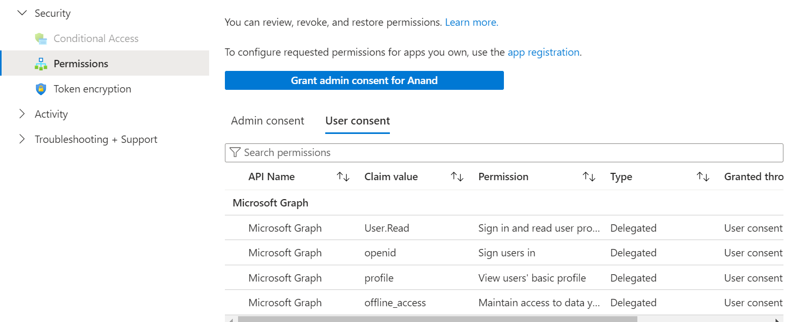

EntraID --> Manage --> App registrations --> New registration

Register an app with name, supported acc, redirect uri

to your application,
# add identity package
dotnet add package Microsoft.Identity.Client

# include identity.client and enable async operations
using System.Threading.Tasks;
using Microsoft.Identity.Client;

# Use the PublicClientApplicationBuilder to build out the authorization context
var app = PublicClientApplicationBuilder
    .Create(_clientId)
    .WithAuthority(AzureCloudInstance.AzurePublic, _tenantId)
    .WithRedirectUri("http://localhost")
    .Build();

# Code -	Description
.Create	- Creates a PublicClientApplicationBuilder from a clientID.
.WithAuthority -	Adds a known Authority corresponding to an ADFS server. In the code we're specifying the Public cloud, and using the tenant for the app we registered.

When you registered the az204appreg app, it automatically generated an API permission user.read for Microsoft Graph. You use that permission to acquire a token.

This screenshot shows the list of permissions assigned for the app.
